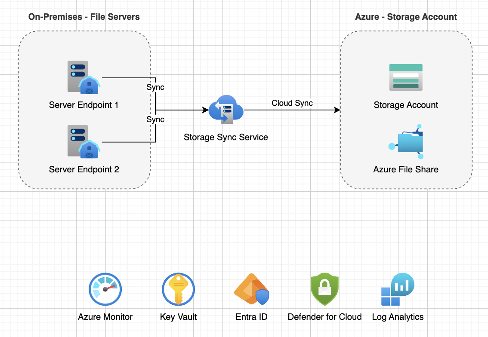

# Scenario: Azure File Sync

## Overview

Using the MCP Server to create an Azure File Sync workload.

### Attempt #1

Prompt: 

```
Create an Azure diagram that shows an Azure File Sync workload. It should show two on-premises servers as the server endpoints.
```

Output:



### Attempt #2

Prompt: 

```
Create an Azure diagram that shows an Azure File Sync workload. It should show two on-premises servers. These two on-premises servers will serve as the server endpoints. In this singular diagram, you should create two parts. Part 1 will show the architecture structure as expected, across on-premises and Azure. Part 2 should be primarily focused on showing the grouping of the Server Endpoints and the Cloud Endpoint relationship. If you need more clarification during the creation process, let me know.
```

Output:


### Attempt #3

Prompt: 

```
Create an Azure diagram that shows an Azure File Sync workload. It should show two on-premises servers, named svr-001 and svr-002. These two on-premises servers will serve as the server endpoints and should be a part of the same Sync Group. 

For the Azure environment, there should be private connectivity configured, according to Microsoft best practice guidance. There should be what is needed for private connectivity, such as:
- a virtual network
- the required private endpoint subnet(s)
- the required privated endpoint(s)
- the required network interface(s)
- Private DNS Zone deployment(s) for privatelink.afs.azure.net and privatelink.file.core.windows.net

Please have a portion of the architecture diagram that indicates the existence of some of the other resources that will be active in the environment, such as: 
- Azure Monitor
- Defender for Cloud
- Azure Log Analytics

In this singular diagram, you should create two parts. Part 1 will show the architecture structure as expected, across on-premises and Azure. Part 2 should be primarily focused on showing the grouping of the Server Endpoints and the Cloud Endpoint relationship. 

If you need more clarification during the creation process, let me know.
```

Output:


### Attempt #4

Prompt: 

```
Create an Azure diagram that shows an Azure File Sync workload. 

For the On-premises environment, it should show two on-premises servers. These two on-premises servers will serve as the server endpoints and will be a part of the same Sync Group. If possible, the diagram should show with icons that each on-premises server has been Arc-enabled and has the File Sync Agent (v21.5) installed.

For the Azure environment, there should be private connectivity configured, according to Microsoft best practice guidance. There should be what is needed for private connectivity, such as:
- Private DNS Zone deployment for privatelink.afs.azure.net and privatelink.file.core.windows.net
- a virtual network
- the required private endpoint subnet(s)
- the required private endpoint(s)
- the required network interface(s)

Create a portion of the architecture diagram that indicates the existence of: 
- Azure Monitor
- Defender for Cloud
- Azure Log Analytics

In this singular diagram, you should create two parts. Part 1 (titled "AFS Architecture Overview") will show the architecture structure as expected, across on-premises and Azure. Part 2 (titled "Sync Group") should be primarily focused on showing the groupings and relationship of the Server Endpoints (on the left) and the Cloud Endpoint (on the right).
```

Output:

