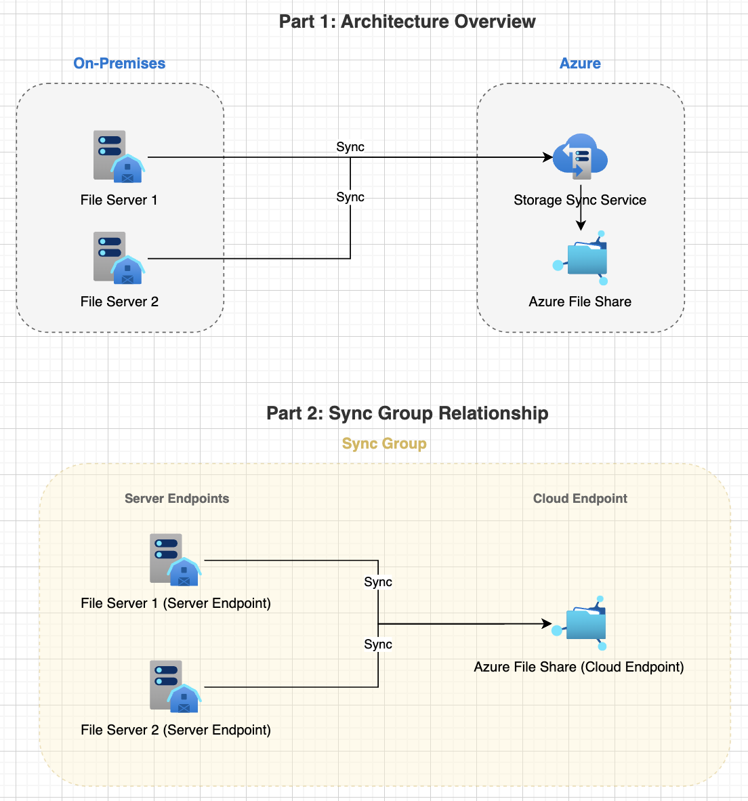
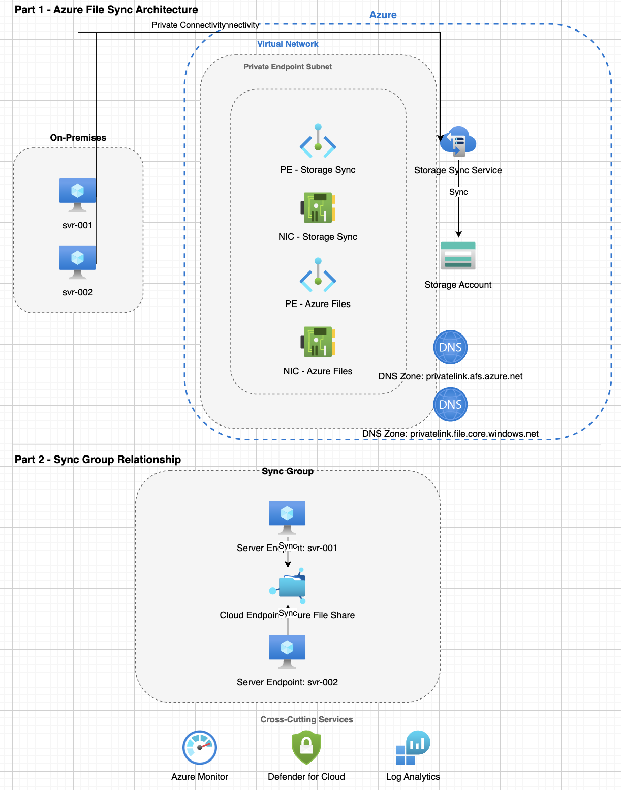
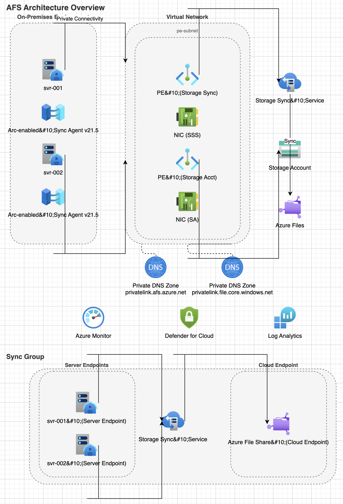
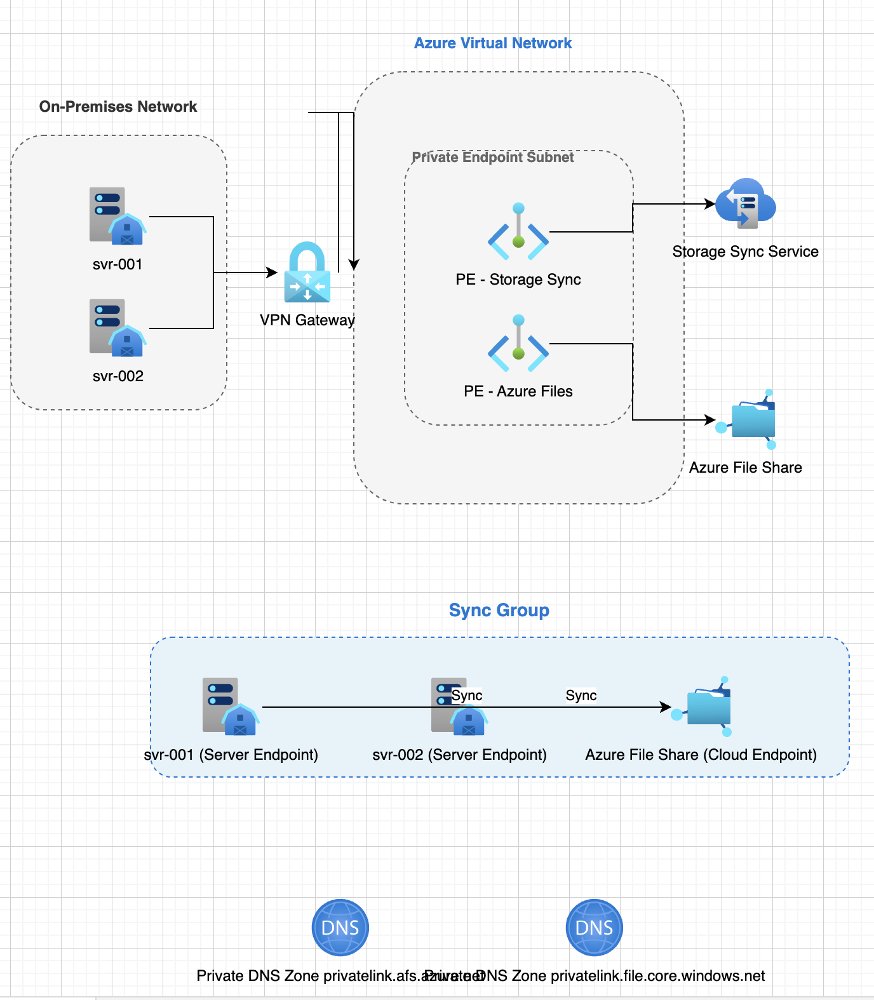

# Scenario: Azure File Sync

## Overview

Using the MCP Server to create an Azure File Sync workload.

### Attempt #1

Prompt: 

```
Create an Azure diagram that shows an Azure File Sync workload. It should show two on-premises servers as the server endpoints.
```

Output:


### Attempt #2

Prompt: 

```
Create an Azure diagram that shows an Azure File Sync workload. It should show two on-premises servers. These two on-premises servers will serve as the server endpoints. In this singular diagram, you should create two parts. Part 1 will show the architecture structure as expected, across on-premises and Azure. Part 2 should be primarily focused on showing the grouping of the Server Endpoints and the Cloud Endpoint relationship. If you need more clarification during the creation process, let me know.
```

Output:




### Attempt #3

Prompt: 

```
Create an Azure diagram that shows an Azure File Sync workload. It should show two on-premises servers, named svr-001 and svr-002. These two on-premises servers will serve as the server endpoints and should be a part of the same Sync Group. 

For the Azure environment, there should be private connectivity configured, according to Microsoft best practice guidance. There should be what is needed for private connectivity, such as:
- a virtual network
- the required private endpoint subnet(s)
- the required privated endpoint(s)
- the required network interface(s)
- Private DNS Zone deployment(s) for privatelink.afs.azure.net and privatelink.file.core.windows.net

Please have a portion of the architecture diagram that indicates the existence of some of the other resources that will be active in the environment, such as: 
- Azure Monitor
- Defender for Cloud
- Azure Log Analytics

In this singular diagram, you should create two parts. Part 1 will show the architecture structure as expected, across on-premises and Azure. Part 2 should be primarily focused on showing the grouping of the Server Endpoints and the Cloud Endpoint relationship. 

If you need more clarification during the creation process, let me know.
```

Output:



### Attempt #4

Prompt: 

```
Create an Azure diagram that shows an Azure File Sync workload. 

For the On-premises environment, it should show two on-premises servers. These two on-premises servers will serve as the server endpoints and will be a part of the same Sync Group. If possible, the diagram should show with icons that each on-premises server has been Arc-enabled and has the File Sync Agent (v21.5) installed.

For the Azure environment, there should be private connectivity configured, according to Microsoft best practice guidance. There should be what is needed for private connectivity, such as:
- Private DNS Zone deployment for privatelink.afs.azure.net and privatelink.file.core.windows.net
- a virtual network
- the required private endpoint subnet(s)
- the required private endpoint(s)
- the required network interface(s)

Create a portion of the architecture diagram that indicates the existence of: 
- Azure Monitor
- Defender for Cloud
- Azure Log Analytics

In this singular diagram, you should create two parts. Part 1 (titled "AFS Architecture Overview") will show the architecture structure as expected, across on-premises and Azure. Part 2 (titled "Sync Group") should be primarily focused on showing the groupings and relationship of the Server Endpoints (on the left) and the Cloud Endpoint (on the right).
```

Output:



### Attempt #5

Prompt:

```
Create an Azure diagram for Azure File Sync. For the sync group, there should be two on-premises servers that are the server endpoints and one Azure File share that serves as the cloud endpoint. Create private endpoints for the Azure Storage Sync Service and Azure File share. Be sure to show the networking components to ensure the architectural components are clearly and accurately indicated.
```



---

## Analysis

> [IMPORTANT]
>
> Attempts 3, 4, and 5 took longer than Attempts 1 and 2

Attempts 2, 3, and 4 seem to be pretty good for different reasons.

Attempt #1 is okay, but was mostly just to gauge what the simplest of prompts would produce.

Attempt #2 is **_very_** high-level, but there wasn't much effort to the prompt at all. It would allow a CSA to explain something, but it probably would be just as quick for the CSA to find an existing diagram or draw one themselves, if they wanted something _this_ basic.

Attempt #3 is pretty good. While you lose a bit of clarity of the Sync Group, you get more of the infrastructure components and flow/routing. It would be a decent point for CSAs to make some edits to the existing components and add some as well.

Attempt #4 seems to be a great starting point for the best of both worlds (overall architecture and sync group relationship). Theoretically, the CSA could make some positional, naming, and other minor edits and have something ready for the customer.

Attempt #5 lost so much life from Attempt #4, likely because I simplified the prompt to lower the context window. GHCP was also reading this file in while running the prompt, which is why although it is shorter compared to Attempts 3 and 4, it still took longer compared to Attempt 2.